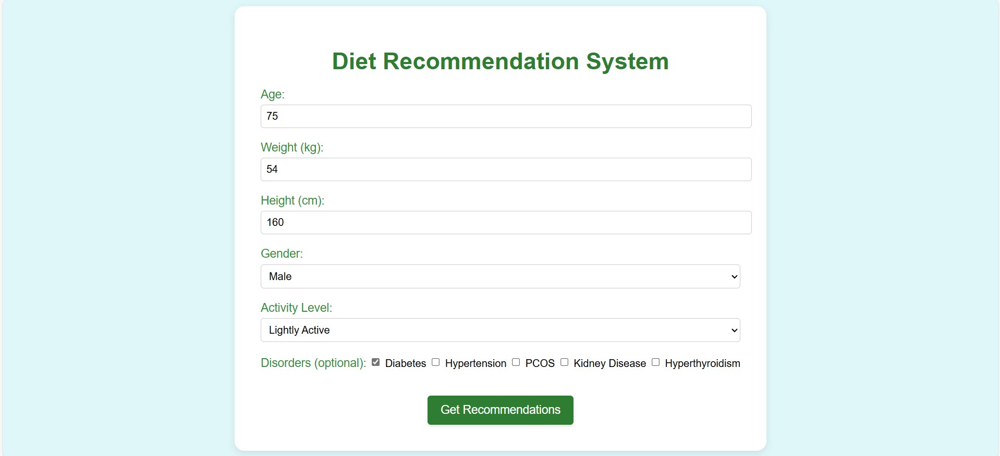
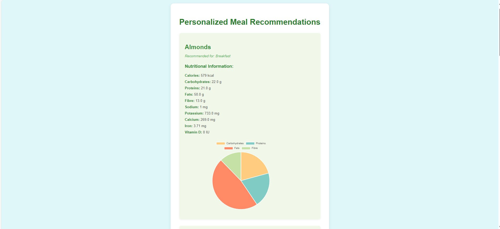

# Data-Driven Diet Recommendation System

## About
Uses basic machine learning to recommend personalized meal plans based on a user's demographic and lifestyle profile. Takes into account nutrient requirements calculated from age, weight, height, gender, and activity level, and further adjusts recommendations based on specific health disorders. Accessible via a Flask-based web interface. Includes exploratory data analysis (EDA) of the food dataset and comparison of ML algorithms for generating meal recommendations.

## Key Features
- **User Profiling**: Accepts inputs such as age, gender, weight, height, activity level, and health disorders.
- **Nutrient Calculation**: Computes Total Daily Energy Expenditure (TDEE) and essential macro- and micronutrient requirements.
- **Disorder-aware Adjustments**: Modifies nutritional targets based on conditions like diabetes, hypertension, kidney disease, and hyperthyroidism.
- **Meal Recommendations**: Recommends suitable food items using the Nearest Neighbors algorithm based on nutritional similarity.
- **Meal Time Classification**: Tags recommended items for breakfast, lunch, or dinner.
- **Nutrient Visualization**: Generates a pie chart to show the macronutrient distribution of the selected meals.
- **EDA and ML Evaluation**: Analyzes the food dataset and compares performance of basic ML models.

## Tech Stack
- **Backend**: Python, Flask
- **Data Processing**: pandas, numpy
- **Machine Learning**: scikit-learn
- **Visualization**: matplotlib
- **Frontend**: HTML (Jinja2 templating)

## Dataset
- `food.csv` includes nutritional data for various food items.
- Each item includes nutrient values and suitability tags for specific disorders and meal times.
  

## Accuracy 
- The system utilizes the Nearest Neighbors algorithm to identify food items with nutritional profiles most similar to the user's needs.
- Performs better compared to K-Means and Random Forest algorithms in terms of nutrient alignment and recommendation relevance.
- Achieved effective recommendations with good cosine similarity scores (>0.95) between user nutrient vectors and matched meals.
- The system maintains dietary relevance while avoiding overfitting, as no user-specific training is involved.

## Screenshots of Flask App

### Home Page

### Recommendation Results and Pie Chart Visualization

